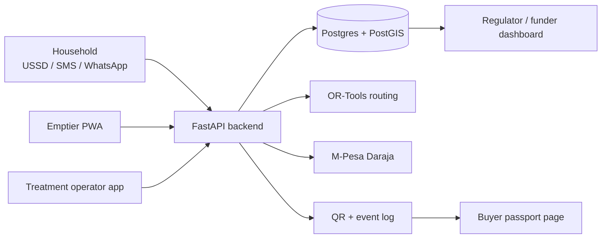

# Architecture

```mermaid
flowchart LR
    H[Household<br/>USSD / SMS / WhatsApp] --> API[FastAPI backend]
    E[Emptier PWA] --> API
    O[Treatment operator app] --> API
    API --> DB[(Postgres + PostGIS)]
    API --> R[OR-Tools routing]
    API --> P[M-Pesa Daraja]
    API --> Q[QR + event log]
    DB --> D[Regulator / funder dashboard]
    Q --> B[Buyer passport page]
```

Core data model: `Household -> Job -> Trip -> Load -> Batch -> TreatmentLog -> Product -> Sale`
